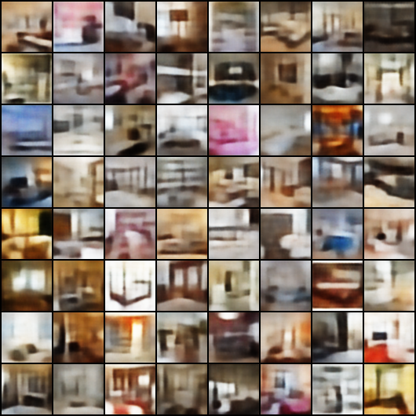
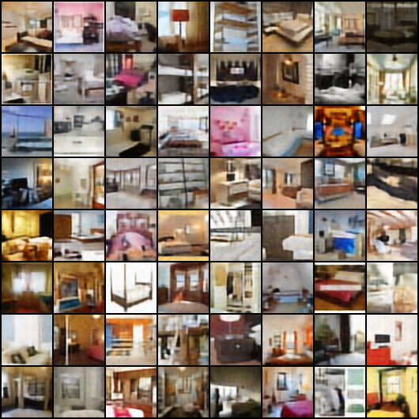
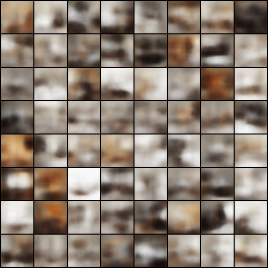

# Minimal PyTorch implementation of Generative Latent Optimization

This is a reimplementation of the paper

> Piotr Bojanowski, Armand Joulin, David Lopez-Paz, Arthur Szlam:  
> [Optimizing the Latent Space of Generative Networks](https://arxiv.org/abs/1707.05776)  

I'm not one of the authors. I just reimplemented parts of the paper in PyTorch for learning about PyTorch and generative models. Also, I liked the idea in the paper and was surprised that the approach actually works.

Implementation of the Laplacian pyramid L1 loss is inspired by [https://github.com/mtyka/laploss](https://github.com/mtyka/laploss). DCGAN network architecture follows [https://github.com/pytorch/examples/tree/master/dcgan](https://github.com/pytorch/examples/tree/master/dcgan).

### Running the code

First, install the required packages. For example, in Anaconda, you can simple do
```
conda install pytorch torchvision -c pytorch
conda install scikit-learn tqdm plac python-lmdb pillow
```
Download the [LSUN dataset](https://github.com/fyu/lsun) (only the bedroom training images are used here) into `$LSUN_DIR`. Then, simply run:

`python glo.py $LSUN_DIR`

You can learn more about the settings by running `python glo.py --help`. 

### Results

Unless mentioned otherwise, results are shown from a run over only a subset of the data (100000 samples - can be specified via the `-n` argument). Optimization was performed for only 25 epochs. The images below show reconstructions from the optimized latent space.

Results with 100-dimensional representation space look quite good, similar to the results shown in Fig. 1 in the paper. Maybe training for more epochs or from the whole dataset will make the images even sharper.

`python glo.py $LSUN_DIR -o d100 -gpu -d 100 -n 100000`


---

Results with 512-dimensional representation space:

`python glo.$LSUN_DIR -o d512 -gpu -d 512 -n 100000`

---

Comparison to L2 reconstruction loss, 100-d representation space:
`python glo.py $LSUN_DIR -o d100_l2 -gpu -d 512 -n 100000 -l l2`


---

Comparison to L2 reconstruction loss, 512-d representation space:
`python glo.py $LSUN_DIR -o d512_l2 -gpu -d 512 -n 100000 -l l2`

---

I observed that initialization of the latent vectors with PCA is very crucial. 
Results from random (normally distributed) look not so good
`python glo.py $LSUN_DIR -o d100_rand -gpu -d 100 -n 100000 -i random -e 100`

After 25 epochs, loss is only `0.31` (when initializing from PCA, loss after only 1 epoch is already `0.23`). Reconstructions look really blurry:



